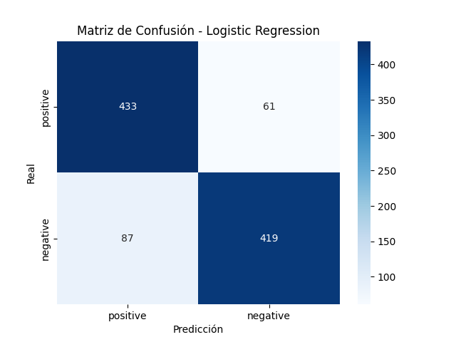
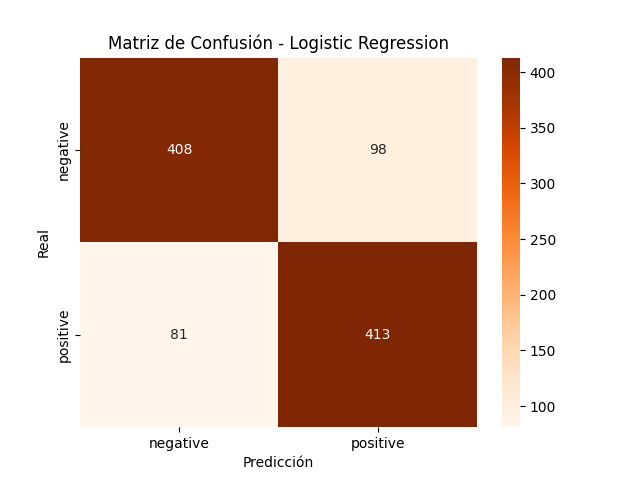

# 🎬 IMDB Sentiment Analysis

## 📌 Descripción
Este proyecto implementa un clasificador de análisis de sentimientos para reseñas de películas del dataset IMDB, utilizando Bag of Words y un modelo de Regresión Logística.

- El objetivo es clasificar reseñas como positivas o negativas, practicando el flujo completo de un proyecto de Machine Learning supervisado:
- Preprocesamiento y limpieza de texto
- Vectorización con Bag of Words
- Entrenamiento y evaluación de un modelo
- Interpretación de resultados

Además de usar la librería de sklearn, también se desarrolló una implementación manual de Regresión Logística desde cero, programando la función sigmoide, la función de coste y el gradiente descendente para comprender mejor cómo funciona el modelo a bajo nivel. A partir de esto también hemos podido analizar las diferencias entre las implementaciones y su escabilidad.

---

## 📂 Dataset
El dataset proviene de [Kaggle - IMDB Dataset of 50K Movie Reviews](https://www.kaggle.com/datasets/lakshmi25npathi/imdb-dataset-of-50k-movie-reviews/data).


⚠️ **Nota:**  
Los archivos CSV no se incluyen en este repositorio debido a su tamaño.  
Para reproducir este proyecto:  
1. Descarga el dataset desde el enlace de Kaggle.  
2. Coloca el archivo `IMDB Dataset.csv` en la carpeta raíz del proyecto.

---

## 🚀 Flujo del proyecto
1. **Carga y limpieza de datos**  
2. **Vectorización (Bag of Words)**
   : Se usa CountVectorizer con un límite de 5000 palabras más frecuentes.
3. **División Train/Test**
   : 80% entrenamiento, 20% prueba.
4. **Entrenamiento**
   - Versión manual: Implementación de regresión logística con descenso por gradiente.
   -  Versión sklearn: Uso de LogisticRegression con regularización y optimización avanzada.
5. **Evaluación**  
6. **Interpretación**  
---

## Resultados
- **Accuracy sklearn:** ~0.88
- **Accuracy versión manual:** ~0.82
  
- **Palabras más influyentes:**  
  - *Positivas:* excellent, amazing, wonderful, ...  
  - *Negativas:* boring, worst, waste, ...
---
## Matriz de Confusión de ambas implementaciones 📊
### Matriz de Confusión versión sklearn
 
---
### Matriz de Confusión versión manual 

---
## Conclusiones
La diferencia se debe a que sklearn implementa optimizadores más sofisticados y regularización que evita el sobreajuste, mientras que la versión manual usa un gradiente descendente básico con tasa de aprendizaje fija. La implementación manual es útil para fines didácticos y la compresión teórica nos ha ayudado a entender este modelo que puede llegar a ser la base de muchos otros pertenecientes al mundo del Machine Learning. Mientras que la segunda implementación es la opción eficiente para aplicaciones prácticas y datasets a gran escala.

Este proyecto permitió:

- Practicar el flujo completo de NLP clásico con Bag of Words.

- Comprender la importancia de la vectorización y el preprocesamiento.

- Comparar una implementación manual de Regresión Logística con la versión de sklearn.

- Observar cómo la regularización y los optimizadores avanzados mejoran la precisión del modelo.

¡Como mejora futura, se podrían probar métodos más avanzados como TF-IDF, Word Embeddings o modelos de Deep Learning (LSTM, Transformers) para aumentar la precisión!

## 📦 Instalación y ejecución
1. Clonar repositorio:  
   ```bash
   git clone https://github.com/Nicki-28/imdb_Sentiment_Analysis.git
   cd imdb_Sentiment_Analysis
2. Instalar las dependencias:
   ```bash
   pip install -r requirements.txt
